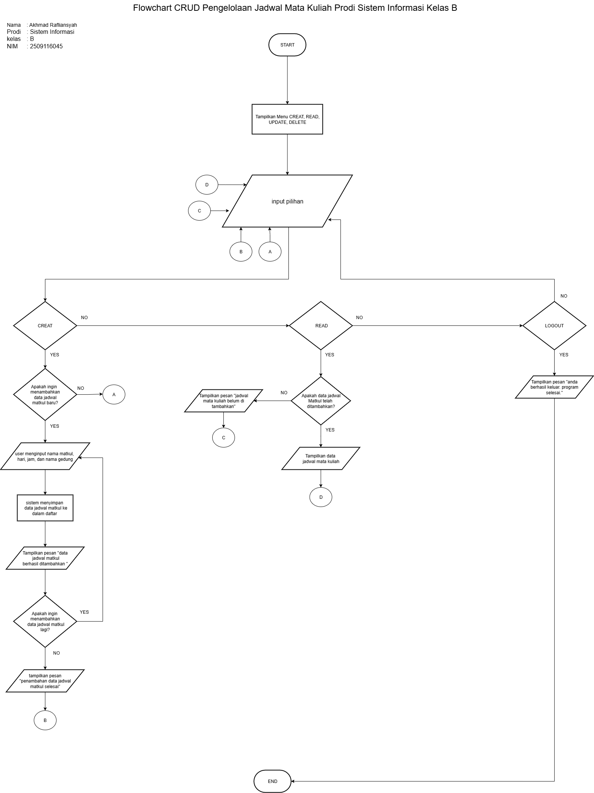

# MinPro_1
# Tema  : Pengelolaan Jadwal Matkul Prodi Sistem Informasi Kelas B
# Nama  : Akhmad Rafliansyah
# prodi : Sistem Informasi
# kelas : B
# NIM   : 2509116045

## Flowchart

**Penjelasan Flowchart:**
1. Program dimulai dari **START**
2. User akan melihat beberapa menu pilihan yaitu **CREAT**, **READ**, **DELETE**, **LOGOUT**.
3. User akan memilih 1 dari 4 pilihan
4. Jika user memilih **CREAT** maka akan ada 2 pilihan yaitu ingin menambahkan data baru atau tidak. jika user memilih tidak maka user akan langsung menuju menu utama lagi. jika user memilih ingin menambahkan data baru maka user harus menginput **nama matkul, hari, jam, dan nama gedung**. setelah itu sistem akan menyimpan data ke dalam daftar dan akan mendapatkan pesan yaitu **"data berhasil di tambahkan"**. alur berlanjut user akan mendapatkan dua pilihan lagi yaitu ingin menambahkan data lagi atau tidak. jika user memilih ingin menambahkan data lagi maka user akan kembali menginput data. jika user memilih tidak maka akan mendapatkan pesan **"penambahan data jadwal matkul selesai"**. selanjutnya user kembali menuju menu utama.
5. jika user memilih **READ** maka akan ada pertanyaan **"apakah user telah menambahkan data jadwal matkul kedalam daftar?"**. jika user belum menambahkan data jadwal matkul maka user akan mendapatkan pesan **"jadwal matkul belum ditambahkan"** dan user akan langsung menuju menu utama. jika user sudah menambahkan data jadwal matkul maka sistem akan menampilkan daftar jadwal matkul yang sudah di tambahkan. selanjutnya user akan kembali menuju menu utama.
6. jika user memilih **LOGOUT** maka user akan mendapatkan pesan **"anda berhasil keluar, program selesai"** dan program akan langsung berhenti/**END**.
